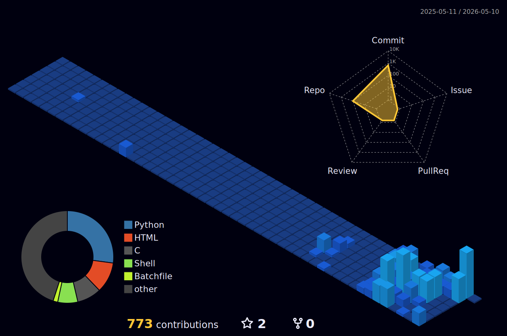

# ⚡ KALETH CORCHO
### 💻 Tecnico Senior | Ingenieria de sistemas

 

---

### 🛠️ Stack Tecnológico

  
  
  

### 🛡️ Áreas de Expertise
| **Ciberseguridad** | **Programación** | **Redes** | **Soporte Técnico** |
| :---: | :---: | :---: | :---: |
| Pentesting | Automatización | Configuración | Troubleshooting |
| Hardening | Scripting | Seguridad | Infraestructura |

---

### 📊 Mi Actividad en 3D

  

 

---

### 📬 Contacto
¿Tienes un proyecto interesante o una consulta técnica?
 
🔗 [sitio web]([https://kaleth4.github.io/](https://github.com/kaleth4/KALETH-CORCHO/edit/main/README.md)

